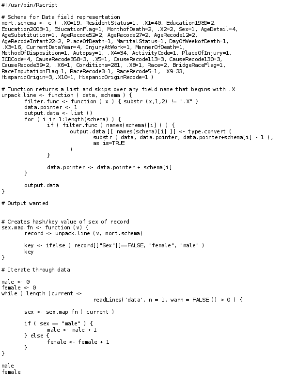

Algorithm Efficiency
============================================

Another approach to performance computing is algorithm efficiency.  Usually,
this represents code profiling and extensive work to squeeze out almost minimum
performance percentages.  However, in scientific computing, we should think of
algorithm efficiency as choosing the correct toolset to complete the job.

The figure above, shows some R code that was adapted from `R in a nutshell
<http://shop.oreilly.com/product/9780596801717.do>`_ book by Joseph Adler.
This code was used to parse the 2009 US Mortality data set and simply determine
the number of deaths by genetic sex (Male or Female).  In the book, Joseph
Adler adapts this code to use the 'rms' package which takes advantage of
Hadoop.  And while this certainly gives the correct answer.  This is not the
correct way to approach this problem.  This R code using a single processor
runs in 9 days on a 1.1GB input file.

If we modify the task using `GNU Core utilities
<http://www.gnu.org/software/coreutils/coreutils.html>`_, which contains a set
of basic text manipulation utilities::

    cut -b 69 | awk '{ if ( $1=="F" ) s = s + 1 } END { print s, NR-s }'

This code took 5.679 seconds to run.  Giving exactly the same answer.  This
example is very simplistic.  But the message is applicable, R was never written
intended to do large text parsing activities - it was built for graphics and
mathematics.  GNU Core utilities where written to do large text parising
activities.  Therefore, by just using the correct tools we can
greatly simplify and speed up our workflows without ever having to use
parallel computing techniques.
