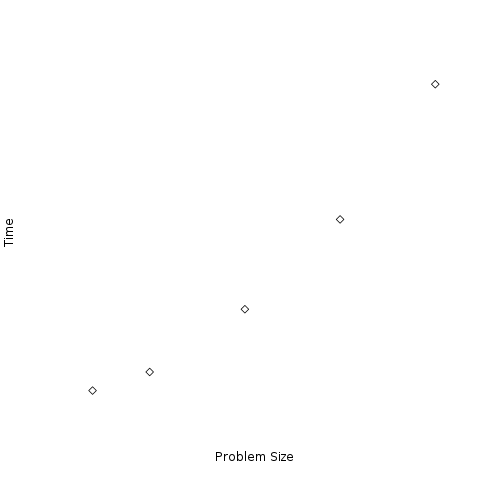
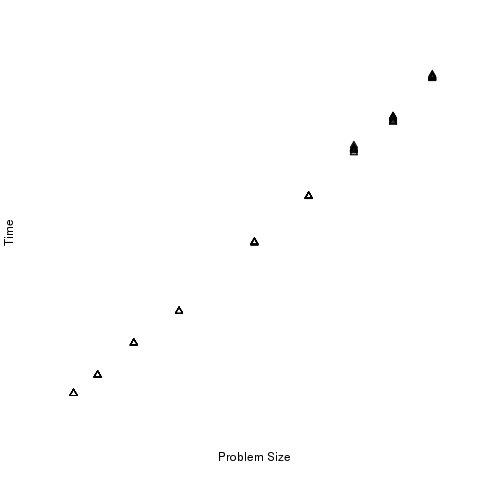
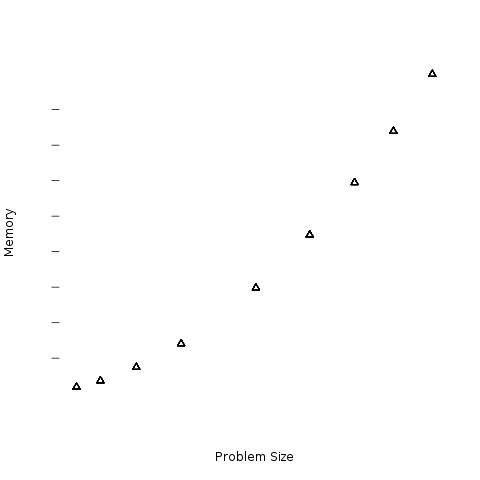

Measurements
============

**Goal** - To empirically determine which limitations need to be addressed.  

Problem Size/Compute time Correlation
-------------------------------------

With all computing applications, as your input size increases the time it takes
to run the program will also increase.  This will always happen, however
depending on the complexity of the algorithm, the magnitude of the time
increases will be different, and needs to be measured.  Additionally, most
programs will increase their memory use as the problem size increases.
However, some programs will produce drastic changes in memory use with only
small problem size increments.  Other programs may almost seemingly handle any
problem size and not increase memory usage at all.  A quick and dirty way to
measure this is to run the application with varying problem sizes, and measure
the execution time and memory usage.  Essentially, creating a standard curve
for these two parameters - quickly letting you know what limitations you will
encounter when you scale this application to large data sets.

.. image:: images/memory/laplace.png
    :scale: 50

The above data points shows an application that has essentially a linear time
increase with problem size, but the memory usage is not an issue.  Each tick
mark represents 16GB of memory.  The memory footprint, even at large problem
sizes almost never exceded 1.5GB.  However, the compute time still needs to be
reduce for large problems to be attenable.  This would be an application that
would benefit from parallel computing.

Our second example shows an application that also has a linear compute time
increase.  However, the memory usage is also an issue.  In fact, even at modest
problem sizes, the memory usage is above 64GB of RAM - larger than most
standard servers; and certainly above workstations typical available memory.
This application needs to both address compute time and memory usage, thus
distributed computing would be the selected method.
