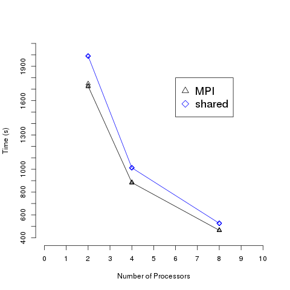

Comparison
==========================================

How does the performance between shared memory parallel computing and MPI
applications compare?

MPI is faster.  This is because there is less of an overhead than with
libraries like openMP.  However, MPI requires more modifications to code, and
thus is usually harder to implement.  This difference in learning curve is
usually why shared memory parallel computing is still widely implemented rather
than solely using MPI.  There is another reason why MPI is not widely used over
shared memory parallelism, which is explained on the next page.
