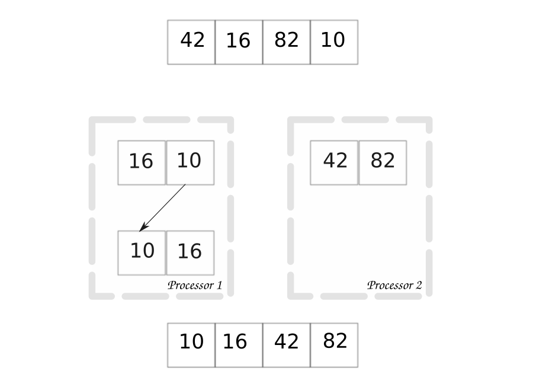
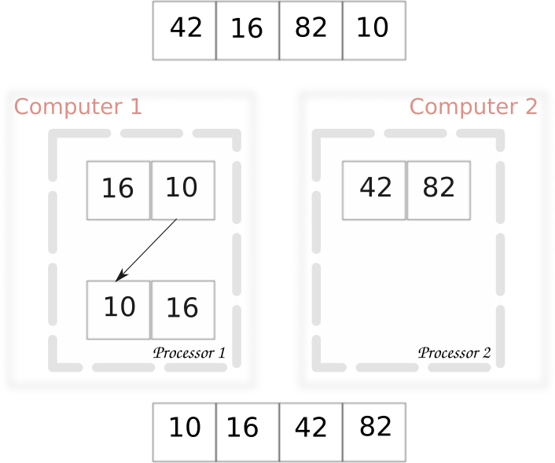

Distributed Sort
==================

Distributed and parallel algorithms are conceptually identical.  The only
difference is the interface used to share data between processors.  In
distributed computing we use a network, while shared memory parallel computing
uses pipes or semaphores.  This difference changes the libraries you will use,
but the concepts are the same.

Above is the parallel sort algorithm shown earlier.  The distributed algorithm
is identical.  Except that we indicate that each
processor resides on a separate computer.

At this point terminology starts to get fuzzy.  Both methods are technically
parallel computing - which is any computing method that utilizes multiple
processors.  But distributed computing specifically involves networked
communication between system parts.  Technically speaking, not all distributed
systems are parallel, but all parallel systems that use multiple computers are
distributed.  In practice, we only use the differing terms here to distinguish
the different methods.  Distributed computing can alleviate large memory
limitations, while shared memory parallel computing can not.
