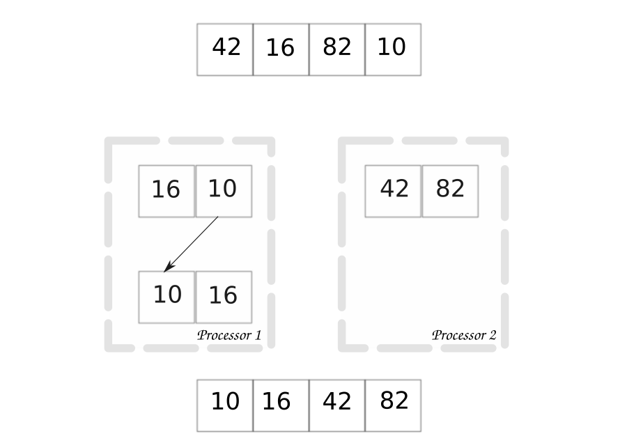

Overview
====================

A quick conceptual view of parallel computing.  We start with a serial
algorithm, specifically a sort algorithm.

.. image:: images/serialsort.png
    :scale: 50
    :align: center

The algorithm starts with an array of integers.  Simply, the application
iterates through each integer and moves the integers to the correct array spot
to make the array sorted.  As we move through the array, we eventually get to
the last integer, and thus have a numerically sorted array.

While this sort algorithm is simple, and their are more efficient ways to sort
an array.  The concept is simple enough to compare to a parallel approach of
the same algorithm.

In the parallel algorithm, we split the array into two subsets by some
criteria.  Here, we give processor 1 all integers less than 40, and processor 2
gets all integers greater than 40.  Each processor then sorts their own array
of integers.  After we simply concatenate the sorted sub arrays to get the
entire sorted array.

.. note:: Parallel computing requires some shared memory between processors.
    In this instance, each processor shares the initial integer array.  This is
    why parallel computing can sometimes be refered to as shared memory
    computing.  This is why parallel computing will not reduce memory usage,
    and therefore is not attenable on large memory applications.  We will see
    how to handle large memory use when we discuss distributed computing.
