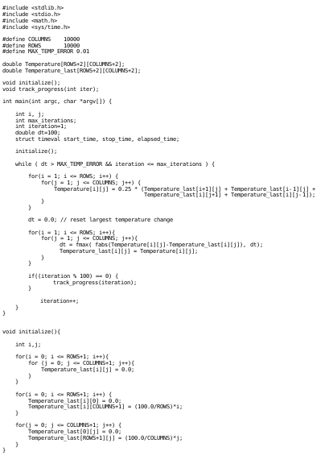
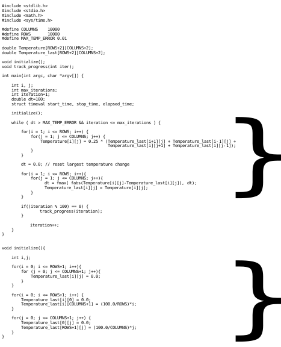

Amdahl's law
================

`Amdahl's law <https://en.wikipedia.org/wiki/Amdahl's_law>`_ is a principle
that provides the theoretical speedup of an application.  In simplest terms, it
states that your performance gains will be limited to the percentage of the
application that is being improved.  A simple example.

Above shows 72 lines of code.  These 72 lines of code make up 100% of the
execution time.  However, 

The above figure, brackets the lines of code that parallel techniques can be
applied.  Which sums to 34 lines of code.  Only the percentage of execution
time these 34 lines of code make up, can be improved by parallel computing.
Fortunately for us, in this application the 34 lines of code makes up 94% of
the execution time.  So this application can see large performance gains
through parallel computing.  However, some applications might only be able to
see modest performance gains, if areas that can be parallelized only make up a
marginal portion of the execution time.
