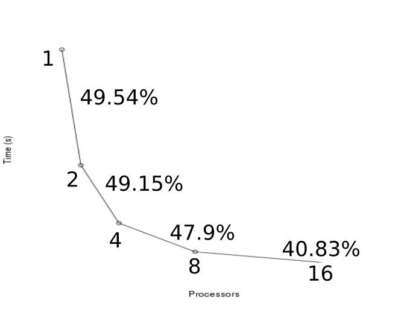

Performance Gains
===============================

In a perfect world, performance gains would be perfectly linear to the number
of processors you are currently utilizing.  For example, if on one processor, an
application takes 1 hour to complete.  Then 2 processors should finish in 30
minutes, 4 processors should complete in 15 minutes, and so forth.
Unfortunately, this is not the observed performance gains.

Over 16 processors we see a 92% reduction in execution time.  As we add more
processors, performance gains are diminished (albeit still good for this
application).  Each application will see a different level performance, which
is determined by two main principles.
