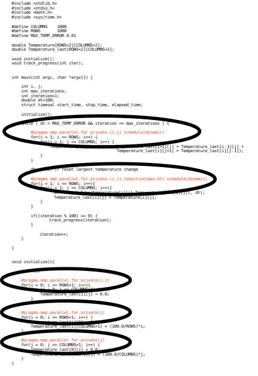

Parallel Overhead
=========================

Complicating Amdahl's law, parallel lines of code also adds to the total lines
of code.

The lines of code circled in the image above, shows only 5 lines of code.  But
these lines of code get expanded to lines of code that sets up the parallel
environment.  These lines of code take execution time.  This is referred to as
parallel overhead, it's the performance cost you take on to be able to utitlize
parallel computing.

.. tip:: In practice, you would never measure the theoretical limit of your
    performance gains.  Since adding parallel computing usually only takes a
    few lines of code, it is almost always quicker to just add parallelization
    and observe your performance gains.
